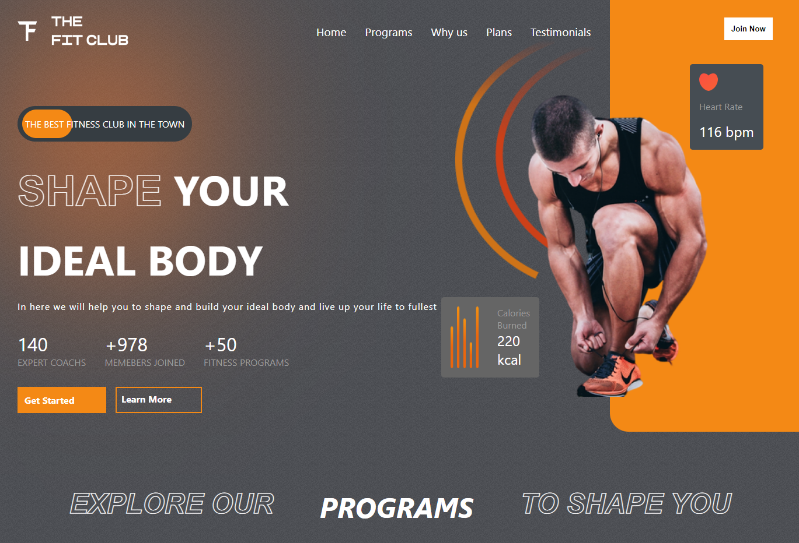
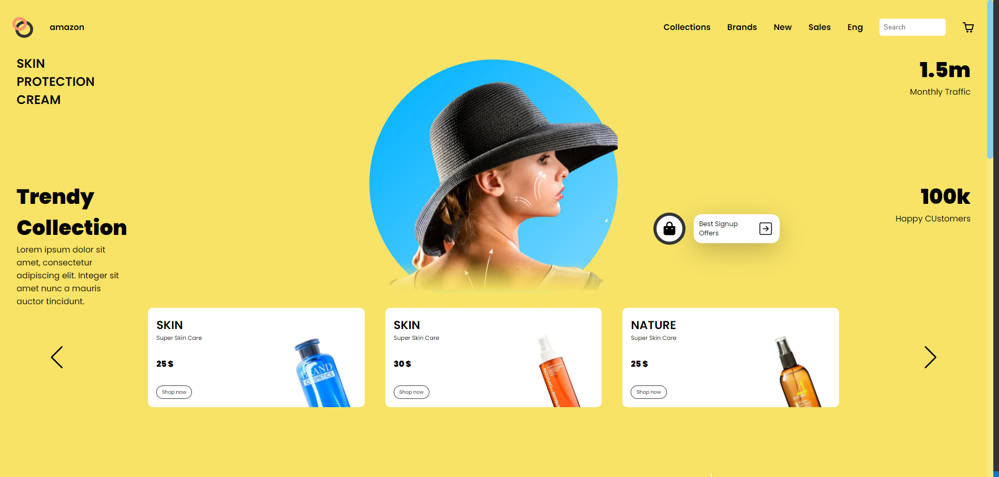
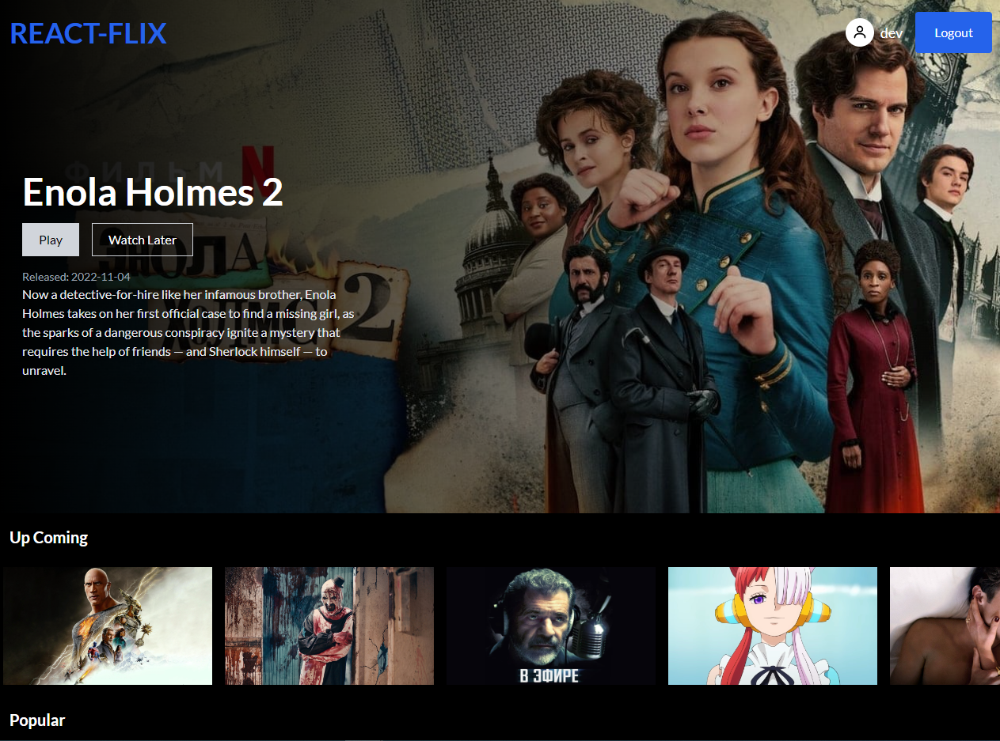

  

  <a href="https://aitorqc.es" target="_blank"> PORTFOLIO</a>

## Tecnologías

Aquí están algunas de las tecnologías con las que estoy más familiarizado:

  

  [PORTFOLIO](https:/aitorqc.es)

                      

## Proyectos

Aquí hay algunos proyectos en los que he trabajado recientemente:

  
  
  

## Contacto

Si quieres ponerte en contacto conmigo, puedes encontrarme en , o enviarme un correo electrónico a .
